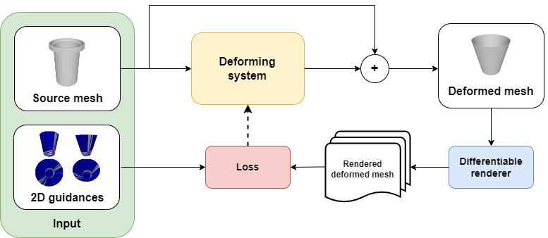
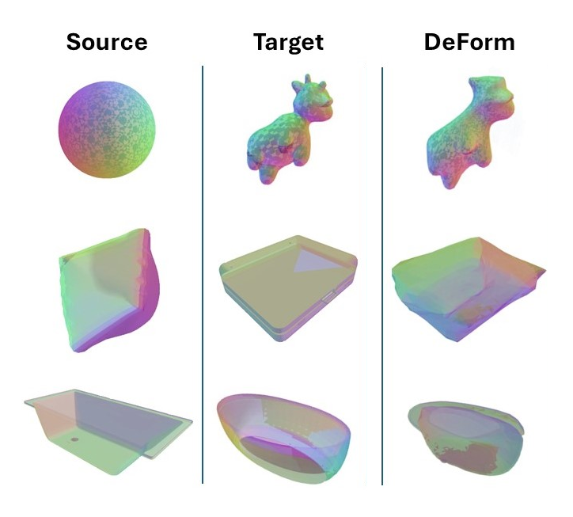

# DeForm: Neural Shape Deformation through 2D Guidance

## Overview
This project aims to enhance the approach introduced in the "Text2Mesh" paper by incorporating an innovative twist. The primary objective is to deform a 3D shape based on the guidance provided by a 2D image. Unlike the original paper, our system, called DeForm, takes a 3D shape and a 2D image as input, where the latter serves as a guiding influence to deform the initial 3D shape into a new configuration that closely resembles the 2D image. The task is achieved by exploting a feed-forward neural network which computes the vertexes displacement between the input mesh and the mesh represented by the 2D images.

## Advices
It is recommended to look at this detailed notebook to understand more details about the project: code/DeForm.ipynb

## How to run the project
Just run this notebook: code/DeForm.ipynb.

## Key Features
- **Input:**
  - **3D Shape:** The initial three-dimensional shape that needs to be deformed.
  - **2D Image:** The guiding image that influences the deformation process.

- **Deformation Algorithm:**
  - The deformation process involves a novel algorithm that analyzes the features of the 2D image and applies targeted transformations to the 3D shape.

- **Innovation:**
  - Unlike traditional methods, our approach leverages the synergy between 3D shapes and 2D guidance, allowing for more nuanced and realistic deformations.

- **Output:**
  - The output is a deformed 3D shape that closely aligns with the features and characteristics of the provided 2D image.
 

## Outputs (modified meshes)

# Credits
## Collaborators
- Claudio Schiavella (https://github.com/GitCharlie00)
## References
- Text2Mesh paper (https://arxiv.org/abs/2112.03221)
 
